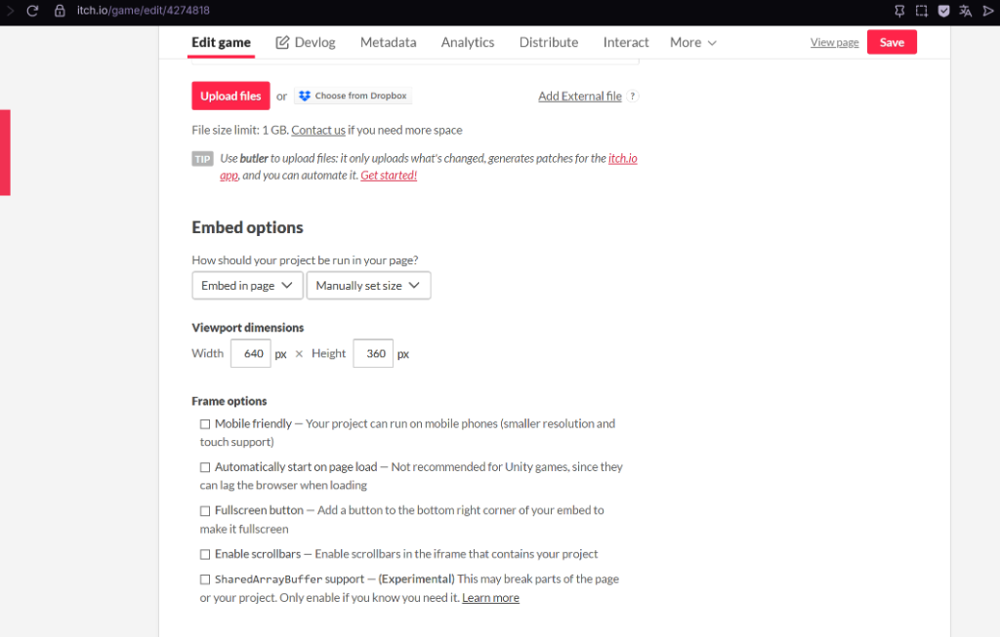
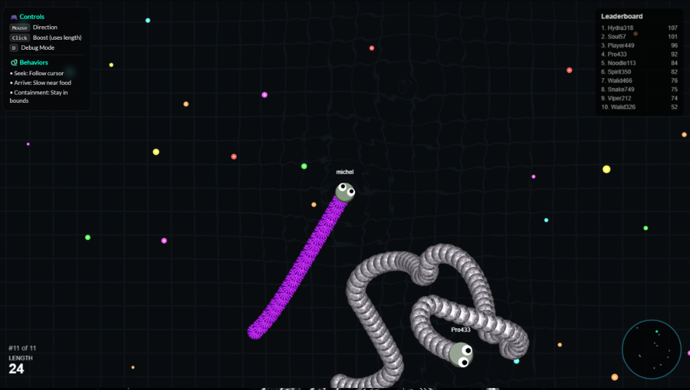

# 🐍 SnakePit - Steering Behaviors

<div align="center">




**Un jeu de serpent multijoueur implémentant les comportements de pilotage autonome de Craig Reynolds**



</div>

---

## 📚 Contexte Académique

Ce projet est une implémentation pratique des **Steering Behaviors** (comportements de pilotage) introduits par **Craig W. Reynolds** en 1999 dans son article fondateur *"Steering Behaviors For Autonomous Characters"*.

Ces algorithmes permettent de simuler des mouvements réalistes et autonomes pour des agents dans un environnement virtuel, sans utiliser de pathfinding complexe.

---

## 🎯 Comportements Implémentés

### 1. Seek (Recherche)

**Principe théorique :**
Le comportement Seek calcule un vecteur de direction vers une cible et applique une force pour s'en rapprocher.

```
desired_velocity = normalize(target - position) × max_speed
steering_force = desired_velocity - current_velocity
```

**Application dans le jeu :**
- Le joueur suit le curseur de la souris
- Les bots cherchent la nourriture la plus proche

---

### 2. Arrive (Arrivée)

**Principe théorique :**
Extension de Seek qui ralentit progressivement l'agent à l'approche de la cible pour éviter les oscillations.

```
distance = |target - position|
if (distance < slowing_radius):
    speed = max_speed × (distance / slowing_radius)
else:
    speed = max_speed
```

**Application dans le jeu :**
- Le serpent ralentit en approchant de la nourriture
- Évite les dépassements et les mouvements brusques

---

### 3. Containment (Confinement)

**Principe théorique :**
Force de répulsion qui maintient l'agent à l'intérieur d'une zone définie (ici, un cercle).

```
distance_to_center = |position|
if (distance_to_center > boundary_radius - margin):
    steering = -normalize(position) × repulsion_strength
```

**Application dans le jeu :**
- Les serpents sont repoussés vers le centre s'ils approchent du bord
- Empêche la sortie de la zone de jeu

---

### 4. Wander (Errance)

**Principe théorique :**
Mouvement aléatoire mais fluide basé sur un cercle projeté devant l'agent.

```
wander_point = position + forward × wander_distance
wander_target = wander_point + random_point_on_circle(wander_radius)
```

**Application dans le jeu :**
- Les bots sans cible proche explorent aléatoirement
- Crée des mouvements naturels et imprévisibles

---

## 🎮 Contrôles

| Touche | Action |
|--------|--------|
| `Souris` | Diriger le serpent |
| `Clic` | Boost (consomme la longueur) |
| `D` | Mode Debug |

---

## 🤖 Intelligence Artificielle des Bots

Les bots possèdent des niveaux de compétence variables :

| Niveau | Réaction | Agressivité | Erreurs |
|--------|----------|-------------|---------|
| **Noob** (30%) | Lente | Faible | Occasionnelles |
| **Casual** (40%) | Normale | Moyenne | Rares |
| **Pro** (30%) | Rapide | Élevée | Aucune |

---

## 🎨 Système de Skins Shader

8 skins animés utilisant des shaders GLSL :

1. 🌈 **Rainbow Stripes** - Rayures arc-en-ciel animées
2. 🌀 **Plasma Vortex** - Effet plasma tourbillonnant
3. ⚡ **Electric Cells** - Cellules électriques Voronoi
4. ✨ **Starfield Glitter** - Champ d'étoiles scintillantes
5. 💧 **Water Surface** - Surface d'eau avec caustiques
6. ☀️ **Sun Surface** - Surface solaire avec éruptions
7. 💨 **Smoke** - Fumée volumétrique
8. 🏜️ **Granular Ground** - Texture de sable/dunes

---

## 🔧 Difficultés Rencontrées

### 1. Performance des Shaders
**Problème :** Création de multiples contextes WebGL causant des crashs.  
**Solution :** Utilisation d'un **unique buffer WebGL** avec changement de mode via uniform `u_mode`.

### 2. Collisions et Fluidité
**Problème :** Mouvements saccadés lors des changements de direction.  
**Solution :** **Interpolation angulaire (lerp)** pour des rotations fluides.

### 3. Frustum Culling
**Problème :** Rendu de tous les segments même hors écran.  
**Solution :** **Culling basé sur la caméra** - seuls les segments visibles sont rendus.

### 4. Cache Navigateur
**Problème :** Modifications JS non appliquées.  
**Solution :** **Versioning des scripts** (`?v=X`) pour forcer le rechargement.

---

## 📈 Améliorations Effectuées

- [x] **Yeux suivant la souris** (style Slither.io)
- [x] **8 skins shader animés** avec sélection UI
- [x] **Fond animé WebGL** avec grille subtile
- [x] **Panneau d'aide** transparent avec contrôles
- [x] **IA des bots** avec niveaux de compétence
- [x] **Comportement Arrive** pour collecte fluide
- [x] **Spawn aléatoire** pour éviter les conflits initiaux

---

## 🚀 Lancement

```bash
# Installation du serveur local
npx http-server . -c-1

# Ouvrir dans le navigateur
http://127.0.0.1:8080
```

---

## 📖 Références

- Reynolds, C. W. (1999). *Steering Behaviors For Autonomous Characters*. Game Developers Conference.
- Shiffman, D. *The Nature of Code*. Chapter 6: Autonomous Agents.
- p5.js Documentation: https://p5js.org/reference/

---

## 📁 Structure du Projet

```
3-Arrival/
├── index.html      # Page principale
├── sketch.js       # Logique de jeu p5.js
├── snake.js        # Classe Snake (joueur)
├── bot.js          # Classe Bot (IA)
├── food.js         # Classe Food
├── background.js   # Fond animé WebGL
├── skins.js        # Système de skins shader
├── style.css       # Styles UI
└── libraries/      # p5.js
```

---

<div align="center">

**Projet réalisé dans le cadre du cours d'Intelligence Artificielle - MIAGE Casablanca 2024/2025**

</div>
